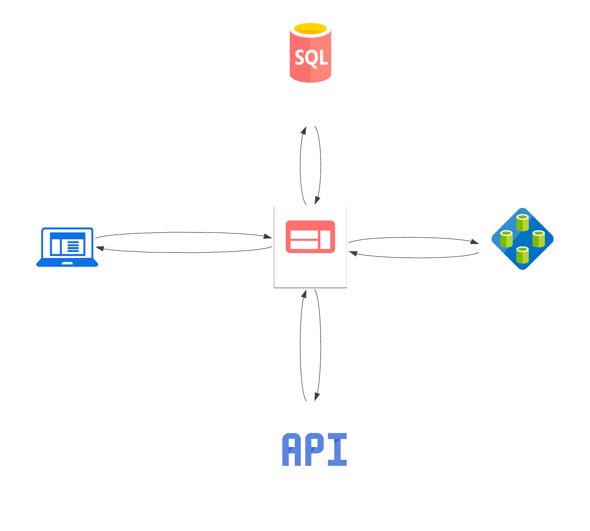
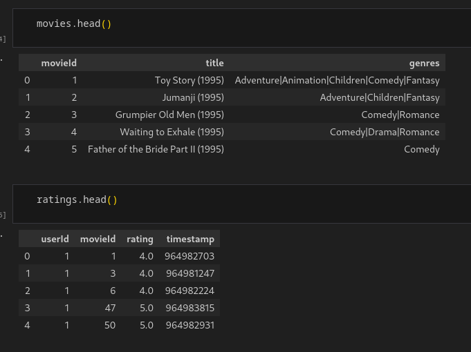
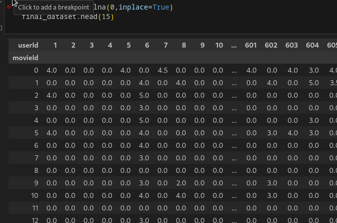
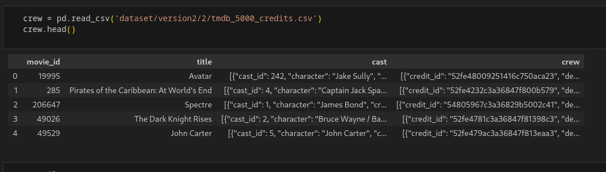
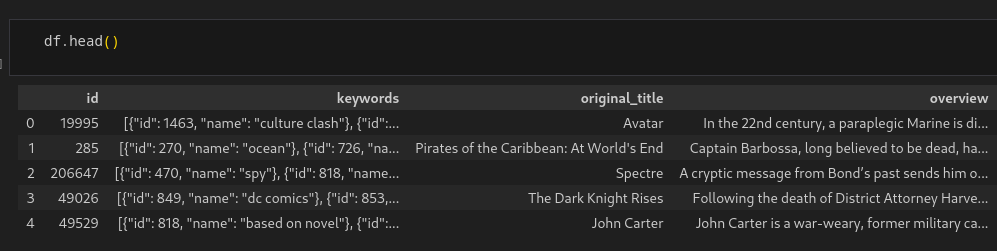
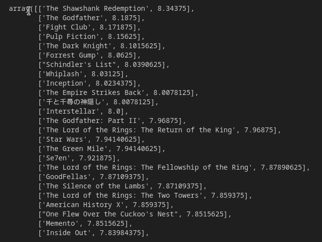
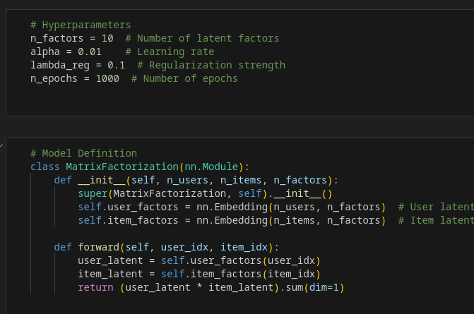

# 🎥 Movie Recommendation System  

---

## 🌟 Overview
The **Movie Recommendation System** suggests movies based on a user's favorite selections. It employs **Collaborative Filtering** and **Content-Based Filtering** techniques to provide personalized recommendations.  
This system integrates data from multiple datasets. To see detailed building of systems, check the provided Jupyter notebooks.

---

## 🎥 Demo

Watch the system in action! 🎬

---

## 🛠️ Tech Stack
- **Frontend**: HTML, CSS (**TailwindCSS** for styling)
- **Backend**: Flask
- **Database**: SQLite
- **Vector Database**: Qdrant
- **Recommendation Engine**:
  - Collaborative Filtering (with and without **Matrix Factorization**)
  - Content-Based Filtering
- **Deployment**: Docker, Render (*Initially deployed with Docker, later migrated to Render*)
- **External APIs**: **OMDB Movie API** (for movie metadata)
- **Server**: Gunicorn
- **Caching**: Redis (for API and page performance optimization)

### 🔥 Additional Optimizations
#### 🚀 Redis Caching for APIs & Webpage
- Implemented **Redis** to cache API responses and improve performance.  
- Reduces database queries and speeds up page load times.  
- Ensures efficient data retrieval for frequently accessed resources.  

---

## 🚀 Project Flow
1. **User selects a favorite movie** 🎬
2. **System retrieves similar movies** based on cosine similarity in Qdrant 🔄
3. **Recommended movies are displayed** along with their metadata 🖥️

### 📊 Real-Time Stats Dashboard with Socket.IO
- Integrated a **live analytics dashboard** displaying:  
  - **Total Visitors**  
  - **Unique Visitors**  
  - **Active Users**  
- Uses **Socket.IO** to provide real-time updates without refreshing the page.  
- Optimized UI with **Tailwind CSS** for a clean and mobile-friendly design.  

---

## 🎭 Collaborative Filtering
Collaborative Filtering is based on user interactions with movies. It uses user ratings to find similarities between movies.

### 🔹 How It Works
- The dataset contains a **user-movie interaction matrix**, where:
  - **Rows** represent movies
  - **Columns** represent users
  - **Values** represent ratings given by users to movies
- Each movie is treated as a **vector representation**
- A **similarity score** (e.g., cosine similarity) is applied to find the closest movies

📌 **Example Representation:**

---

## 🎮 Content-Based Filtering
Content-Based Filtering focuses on movie attributes rather than user interactions.

### 🔹 How It Works
- The dataset contains **movie metadata**, including:
  - Plot
  - Cast (lead actor, actress, etc.)
  - Crew (director, writer, etc.)
  - Genre
  - Year of release
  - Theme
  - Rating
  - Vote Count
- Different **vectorization techniques** are applied to each attribute:
  - **TF-IDF, Count Vectorizer** for text-based data (e.g., plot)
  - **Count Vectorizer** for categorical data (e.g., genre, cast, crew)
  
- Combined vector representations are used for similarity calculations

📌 **Example Representation:**

### 🌟 Adjusted Rating Calculation
The dataset contains vote count and each rating, so I have calculated one true rating based on the **Bayesian Average** formula to ensure fair ranking across movies:
  
  \[
  \bar{R} = \frac{\sum (r_i \cdot v_i) + C \cdot m}{\sum v_i + m}
  \]
  
  where:
  - \( \bar{R} \) = Adjusted rating
  - \( r_i \) = Average rating of the movie
  - \( v_i \) = Number of votes for the movie
  - \( C \) = Mean rating across all movies
  - \( m \) = Minimum votes required to be considered

  This formula prevents movies with very few ratings from getting an unfairly high or low rank by pulling them toward the global average until they receive more votes.

📌 **Example Representation:**

---

## 🔢 Matrix Factorization
Matrix Factorization is used to **predict missing values** in the user-movie rating matrix, improving recommendations.

### 🔹 Why Matrix Factorization?
- **User-movie interaction matrices are sparse** (most values are missing)
- Traditional Collaborative Filtering struggles with missing ratings
- **Matrix Factorization** predicts missing values, improving recommendations

### 🔹 How It Works
- Decomposes the user-movie matrix into **two lower-dimensional matrices**
- Predicts missing ratings by reconstructing the original matrix
- Techniques used: **Neural Network with Mean Squared Error**

📌 **Example Representation:**

---

## 📜 License
This project is open-source and available under the **MIT License**.

---

## 📧 Contact
For questions, suggestions, or collaborations, reach out via:

- 📩 Email: [vedantkoppal@gmail.com](mailto:vedantkoppal@gmail.com)
- 💼 LinkedIn: [Vedant Koppal](https://www.linkedin.com/in/vedantkoppal)
- 🐦 Twitter: [@vedantkoppal](https://twitter.com/vedantkoppal)
